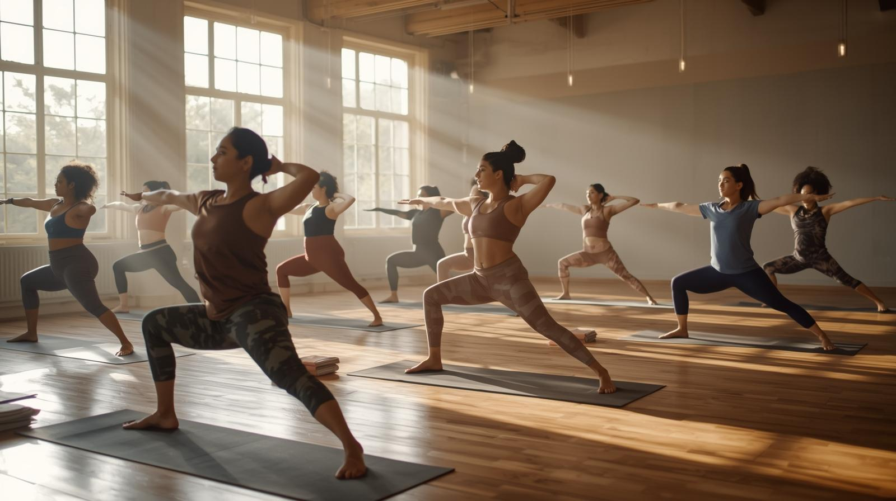

# About Nanaimo Wellness Collective

Nanaimo Wellness Collective was created to bring together mindful movement, evidence-informed practices, and a welcoming community.  
Our mission is to make wellness accessible, sustainable, and free from diet culture or appearance-based pressure.

  
  

    Gentle group yoga in our Nanaimo studio.
  

We focus on three pillars:

1. **Movement:** gentle strength, mobility, and balance  
2. **Mindfulness:** breathwork, grounding, and stress reduction  
3. **Community:** small groups, inclusive language, and collaboration with local partners  

## Core Classes

### Gentle Morning Flow (Yoga)

A slower-paced class that combines stretching, breathwork, and simple standing sequences.

- Level: All levels  
- Length: 60 minutes  
- Ideal for: clients new to yoga or returning after a break  

### Strength & Stability (Mat Pilates)

A mat-based Pilates class focused on core strength, posture, and joint stability.

- Level: Beginner–Intermediate  
- Length: 60 minutes  
- Ideal for: people with desk jobs or mild back/neck tension  

### Evening Restore & Meditation

Restorative poses, deep stretching, and guided meditation to calm the nervous system at the end of the day.

- Level: All levels  
- Length: 75 minutes  
- Ideal for: stress, trouble sleeping, or burnout  

## Class Schedule 

<h2>Class Schedule</h2>

<table style="width:100%; border-collapse: collapse; margin-top:10px;">
  <tr>
    <th style="text-align:left; padding:8px;">Class</th>
    <th style="text-align:left; padding:8px;">Day</th>
    <th style="text-align:left; padding:8px;">Time</th>
  </tr>
  <tr>
    <td style="padding:8px;">Gentle Morning Flow</td>
    <td style="padding:8px;">Monday</td>
    <td style="padding:8px;">8:00–9:00 am</td>
  </tr>
  <tr>
    <td style="padding:8px;">Strength & Stability</td>
    <td style="padding:8px;">Wednesday</td>
    <td style="padding:8px;">6:00–7:00 pm</td>
  </tr>
  <tr>
    <td style="padding:8px;">Evening Restore & Meditation</td>
    <td style="padding:8px;">Thursday</td>
    <td style="padding:8px;">7:30–8:45 pm</td>
  </tr>
</table>

## Pricing Overview 

- **Single class:** $22  
- **5-class pass:** $95  
- **10-class pass:** $180  
- **Private 1:1 session (60 minutes):** $80  

## Additional Offerings

- 1:1 customized private sessions  
- Small-group series for friends or teams  
- On-site workplace wellness sessions for local businesses  

## Target Clients

Our primary clients include:

- University and college students managing academic pressure  
- Young professionals experiencing stress, tension, or burnout  
- Adults who prefer low-impact, sustainable movement rather than high-intensity training  

Our approach emphasizes feeling better in your body today, rather than chasing unrealistic fitness ideals.

## How to Connect

For bookings or questions, clients can email **hello@nanaimowellnesscollective.ca** or visit us near downtown Nanaimo, just a short walk from the waterfront.